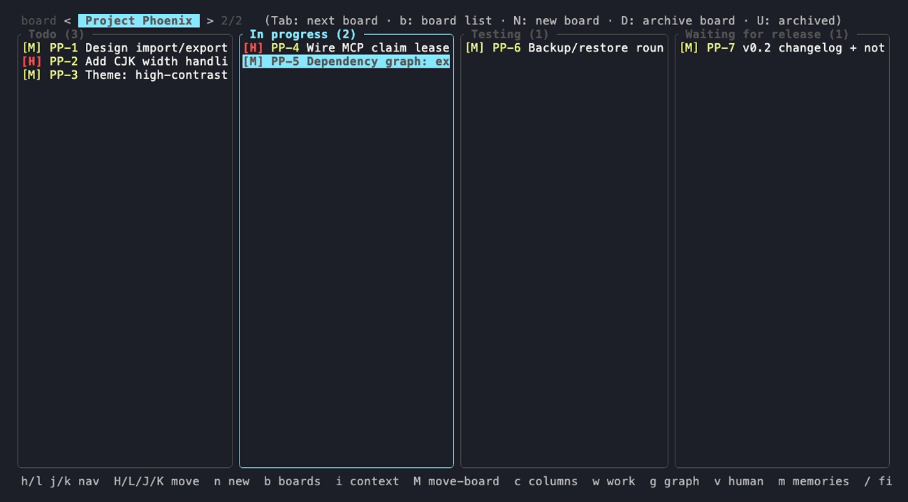

# Kanterm

> A terminal kanban board with an optional MCP interface for automation.

[](https://github.com/shogi9x9/Kanterm/actions/workflows/ci.yml)
[](LICENSE)

日本語版: [README.ja.md](README.ja.md)



Kanterm is a single-user task board with two front ends over one SQLite
database: a **terminal UI** for day-to-day planning and an optional **MCP
server** for scripted or tool-driven workflows. Both can run at the same time
and see each other's writes live.

## Features

- **One board, two surfaces** — the TUI and the MCP server go through the same
  `kanterm-core` crate and the same SQLite (WAL) database, so what you see and
  what external tools edit are always the same data.
- **Single-user, single binary** — native Rust, no hosted service or account
  required; the board opens instantly in any terminal.
- **Automation-ready** — `kanterm-mcp` exposes cards, columns, boards, and a
  memory log over MCP, with claim leases, durable handoffs, and verification
  fields for resumable, auditable work.
- **Execution-oriented cards** — handoff notes, dependencies (DAGs), execution
  metadata, and per-board instructions turn a plan into claimable,
  verifiable work.
- **Multiple boards + memory log** — `workflow` / `planning` / `simple` column
  templates, cross-board moves, archive & restore, and a durable
  decisions/learnings log that survives across sessions.
- **Themeable** — default `glass` theme, built-in `dark` / `light` alternatives,
  and JSON color overrides.

## Install

Download the archive for your platform from the
[latest GitHub Release](https://github.com/shogi9x9/Kanterm/releases/latest):

- `kanterm-linux-x86_64.tar.gz`
- `kanterm-macos-arm64.tar.gz`

Then unpack it and put the binaries somewhere on your `PATH`:

```sh
tar -xzf kanterm-<platform>.tar.gz
install -m 755 kanterm-<platform>/kanterm <install-dir>/kanterm
install -m 755 kanterm-<platform>/kanterm-mcp <install-dir>/kanterm-mcp
```

You can also build from source:

```sh
cargo build --release
./target/release/kanterm          # open the TUI
```

See [docs/mcp.md](docs/mcp.md) to drive the optional MCP server from compatible
clients.

## How it works

```
crates/
├─ kanterm-core   domain + SQLite (WAL). The ONLY code that touches the DB.
├─ kanterm    ratatui board, synchronous terminal UI. Binary: kanterm.
└─ kanterm-mcp    rmcp stdio MCP server, async. Binary: kanterm-mcp.
```

The database location can be overridden with `KANBAN_DB`.
See [DESIGN.md](DESIGN.md) for the full design and the rationale behind each
decision.

## Usage

### TUI

```sh
./target/release/kanterm
```

`h`/`l` move between columns, `j`/`k` within a column, `H`/`L` move a card across
columns, `Enter` opens a card, `n` adds one, `b` switches boards, `q` quits.
The board remembers your focused column, selected card, and active board between
launches.

To edit a card, press `e` for a quick title edit. Open the detail modal with
`Enter`, then press `e` to edit the title or `b` to edit the body. In the body
editor, use `Ctrl-S` to save and `Esc` to cancel.

Full keybindings, the card detail modal, label picker, themes, export, and
backup/restore are documented in **[docs/tui.md](docs/tui.md)**.

### MCP

`kanterm-mcp` exposes the board to MCP clients over stdio. Cards are addressed by
key (e.g. `KB-12`); tools cover reading (`get_board`, `list_cards`, `get_card`),
writing (`create_card`, `create_cards`, `update_card`), structure
(`manage_columns`, `manage_boards`), coordination, durable handoffs, and a
memory log.
`kanterm-mcp watch-handoffs` can run as a lightweight watcher/bridge for
delivering durable handoffs into another runtime, and `kanterm-mcp run-workflow`
can turn a small workflow YAML step completion into a cross-repo handoff.
Reusable target configs let workflows route to command targets now, with
interactive session targets reserved for terminal adapters.

The full tool reference, execution flow, execution metadata, queue filters, and
import examples are in **[docs/mcp.md](docs/mcp.md)**.

## Documentation

- TUI reference: [docs/tui.md](docs/tui.md)
- MCP reference: [docs/mcp.md](docs/mcp.md)
- Design & rationale: [DESIGN.md](DESIGN.md) / [DESIGN.ja.md](DESIGN.ja.md)
- Contributing: [CONTRIBUTING.md](CONTRIBUTING.md) / [CONTRIBUTING.ja.md](CONTRIBUTING.ja.md)
- Releases: [RELEASE.md](RELEASE.md) / [RELEASE.ja.md](RELEASE.ja.md)
- Security: [SECURITY.md](SECURITY.md) / [SECURITY.ja.md](SECURITY.ja.md)
- Changelog: [CHANGELOG.md](CHANGELOG.md) / [CHANGELOG.ja.md](CHANGELOG.ja.md)
- Board migration (MCP): [docs/mcp-card-migration.en.md](docs/mcp-card-migration.en.md) / [docs/mcp-card-migration.ja.md](docs/mcp-card-migration.ja.md)

## Project status

This project is primarily maintained by a single maintainer.
**Pull requests are not accepted.** Please use GitHub Issues for bug reports,
enhancement requests, and general questions.

## License

MIT. See [LICENSE](LICENSE).
